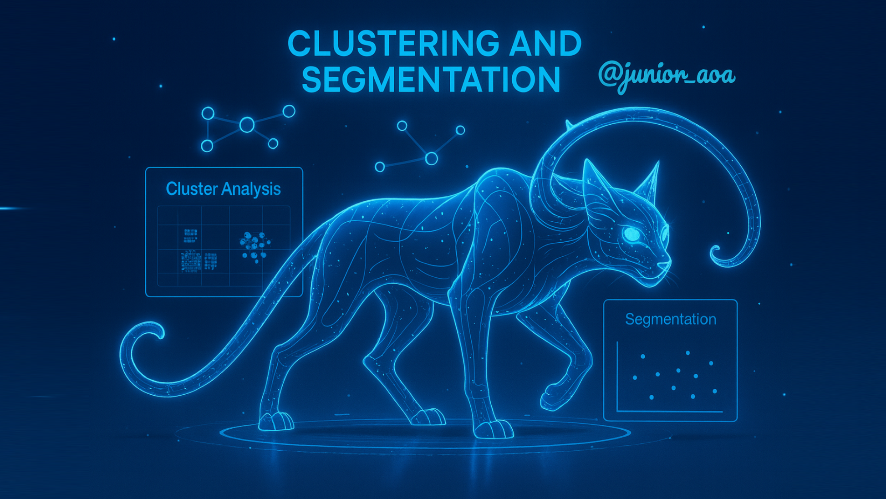

# Clustering Experto: Ajuste de parámetros, drift y migraciones

# 📘 Análisis Estadístico y Clustering Avanzado



## 🎯 ¿De qué trata este repositorio?

Este repositorio es una guía práctica y razonada para aprender y aplicar técnicas de clustering en datos reales, seleccionar hiperparámetros con criterio (Elbow, Silhouette), trabajar con algoritmos basados en densidad (DBSCAN) y mixturas (GMM), y monitorear cambios en el tiempo (data drift) con métricas estadísticas como PSI y KS. Además, encontrarás recomendaciones para interpretar resultados desde el punto de vista técnico y de negocio, evitando trampas comunes y documentando decisiones.

En términos simples, aquí aprenderás a:
- Elegir y preparar variables para clustering (escalado, limpieza, codificación cuando aplique).
- Seleccionar k en K-Means con Elbow y Silhouette y explicar el porqué de la elección.
- Detectar clusters de forma arbitraria y outliers con DBSCAN, ajustando ε y min_samples con el gráfico k‑distancias.
- Modelar clusters probabilísticos con Gaussian Mixture Models (GMM) y entender cuándo preferirlos sobre K-Means.
- Medir drift entre periodos (por ejemplo, años) con PSI y KS, y analizar “migraciones” entre clusters a lo largo del tiempo.

---

## 🗺️ Hoja de ruta: contenido del repositorio

Cada notebook es un paso del recorrido. Todos los cuadernos están pensados para ejecutarse de principio a fin y contienen explicaciones antes de los bloques de código clave.

### 📚 Notebooks

1) 1_Clustering_K_Means_iris.ipynb
   - Objetivo: aplicar K-Means sobre Iris, estandarizar variables, elegir k (opcionalmente con Silhouette), visualizar y explicar la partición.
   - Puntos clave: por qué escalar, cómo leer un scatter coloreado por etiqueta, cómo interpretar centros.

2) 2_Clustering_Jerarquico.ipynb
   - Objetivo: construir clusters jerárquicos, entender “linkage” (single, complete, average, ward) y leer un dendrograma.
   - Puntos clave: elección del umbral de corte, efectos del linkage en la estructura, interpretación práctica.

3) 3_Clustering_densidad_DBSCAN.ipynb
   - Objetivo: detectar regiones densas y ruido con DBSCAN. Elegir ε con k‑distancias y ajustar min_samples.
   - Puntos clave: núcleo/borde/ruido, estandarización, lectura del codo en k‑dist, diagnóstico cuando todo es −1 o todo es un único cluster.

4) 4_Clustering_Mixtura_GMM.ipynb
   - Objetivo: agrupar con Gaussian Mixture Models (mezclas de gaussianas) y comprender diferencias frente a K-Means.
   - Puntos clave: formas elípticas, tipos de covarianza, probabilidad de pertenencia, nota sobre BIC/AIC para elegir componentes.

5) 5_Clustering_Elbow.ipynb
   - Objetivo: dominar Elbow e interpretar Silhouette para seleccionar k de manera razonada.
   - Puntos clave: curva de inercia (SSE) y punto de rendimientos decrecientes; picos/mesetas de Silhouette; balance con interpretabilidad.

6) 6_Clustering_Drift_Web.ipynb
   - Objetivo: medir data drift entre años en métricas web (cargas de página, visitas únicas, primeras y recurrentes) con PSI y KS; entrenar K-Means en un año base y entender cómo cambian los patrones.
   - Puntos clave: parsing de fechas (formato MM/DD/YYYY), limpieza de separadores numéricos, bins de PSI definidos sobre el baseline, lectura combinada de PSI y KS, escalado previo a K-Means.

---

## 💾 Datos incluidos

- daily-website-visitors.csv: tráfico web diario con fecha y métricas (usado en drift y clustering base).
- Iris.csv: datos clásicos de Iris (algunos notebooks utilizan la versión integrada de scikit-learn).
- Miami Housing.csv: ejemplo para DBSCAN con variables numéricas de propiedades.
- NetflixClic.csv, NetflixViewership.csv: datasets de visionado (útiles para ejercicios de agregación y análisis no supervisado por país/periodo).
- Ejemplo Estudiantes.csv, Salaries.csv: archivos de apoyo para prácticas y demostraciones.

Nota: Asegúrate de que estos archivos estén en la misma carpeta que los notebooks para que las rutas relativas funcionen sin cambios.

---

## 📂 Estructura del proyecto

```
Clustering/
├── 1_Clustering_K_Means_iris.ipynb
├── 2_Clustering_Jerarquico.ipynb
├── 3_Clustering_densidad_DBSCAN.ipynb
├── 4_Clustering_Mixtura_GMM.ipynb
├── 5_Clustering_Elbow.ipynb
├── 6_Clustering_Drift_Web.ipynb
├── Banner.png
├── daily-website-visitors.csv
├── Ejemplo Estudiantes.csv
├── Iris.csv
├── Miami Housing.csv
├── NetflixClic.csv
├── NetflixViewership.csv
└── Salaries.csv
```

---

## 🚀 Guía rápida (Windows)

Requisitos mínimos
- Python 3.9 o superior.
- Jupyter Notebook o JupyterLab.
- Librerías: pandas, numpy, scikit-learn, matplotlib, scipy, (opcional) seaborn.

Instalación con pip (CMD)
```
py -m pip install --upgrade pip
py -m pip install pandas numpy scikit-learn matplotlib scipy seaborn jupyter
```

Abrir los notebooks
```
py -m jupyter notebook
```
Se abrirá el navegador; entra a la carpeta Clustering y ejecuta los cuadernos en orden. Si prefieres JupyterLab:
```
py -m jupyter lab
```

---

## 🧠 Conceptos y decisiones clave

- Estandarización (StandardScaler): imprescindible en métodos basados en distancia (K-Means, DBSCAN con métrica euclídea). Evita que una variable domine por escala.
- Selección de k (K-Means): usa Elbow para un rango y Silhouette para refinar; prioriza interpretabilidad si las métricas discrepan.
- DBSCAN (ε y min_samples):
  - Estima ε con k‑distancias alineado con min_samples.
  - Reglas de diagnóstico rápidas: casi todo −1 → ε chico o min_samples grande; todo un solo cluster → ε grande o min_samples chico.
  - Si las densidades son muy dispares, considera HDBSCAN.
- GMM vs K-Means: GMM modela formas elípticas y da probabilidades de pertenencia; K-Means es más simple y eficiente para formas ~esféricas.
- Data drift (PSI y KS):
  - PSI con bins fijos del baseline para comparar proporciones; KS contrasta distribuciones con p‑value.
  - PSI > 0.25 sugiere cambio alto; en KS, p < 0.05 sugiere diferencia significativa.

Migraciones entre clusters en el tiempo
- Entrena K-Means en un periodo base (por ejemplo, año A) con variables escaladas.
- Proyecta datos de otros periodos (año B) usando el mismo escalador y centros.
- Compara proporciones de etiquetas y distancias promedio a centros; un cambio grande sugiere mutación de patrones.
- Complementa con métricas como ARI/NMI si dispones de una referencia, o con “centroid drift” (desplazamiento de centros si reentrenas en B).

---

## 🧪 Reproducibilidad y buenas prácticas

- Fija `random_state` al entrenar (KMeans) para resultados comparables.
- Documenta las decisiones de parámetros (ε, min_samples, k, covarianza en GMM) y justifícalas con gráficos/curvas.
- Maneja nulos y no numéricos: usa `errors='coerce'` y expresiones regulares para limpiar separadores.
- Valida resultados con visualizaciones (scatters, histogramas por periodo) y resúmenes por cluster (medianas, IQR).

---

## 🛠️ Solución de problemas

- “Silhouette es NaN para k=1”: la métrica no aplica con un solo cluster; úsala desde k≥2.
- “DBSCAN asigna casi todo a −1”: prueba aumentar ε o disminuir min_samples; revisa escalado y outliers extremos.
- “No veo codo claro”: prueba otro rango de k, inspecciona curvas suavizadas, prioriza interpretabilidad.
- “Error al parsear fechas”: confirma formato MM/DD/YYYY y usa `errors='coerce'` para evitar interrupciones.

---

## 🤝 Contribuciones

¿Ideas, mejoras o notebooks nuevos? ¡Bienvenidas!
1) Crea una rama: `feature/tu-mejora`.
2) Explica claramente el objetivo y adjunta ejemplos mínimos reproducibles.
3) Mantén el estilo de documentación: título, objetivos, explicación antes de cada bloque crítico y conclusiones.

---

## 📜 Licencia

Si no existe un archivo LICENSE en esta carpeta, asume que la licencia aún no se ha definido. Puedes usar el contenido con fines educativos; para usos comerciales o redistribución, abre un issue para discutir los términos o añade una licencia explícita.

---

Gracias por explorar este repositorio. La meta es que puedas aplicar estos conceptos en tus propios datos, justificar decisiones y comunicar resultados con claridad técnica y de negocio. ¡Feliz clustering!
